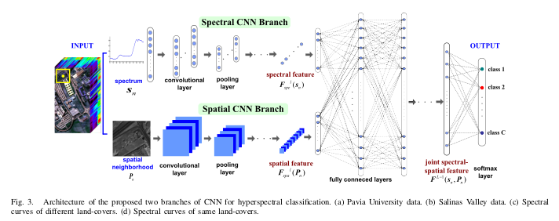

What we are trying to implement:

Paper link:

https://www.researchgate.net/publication/317053979_Learning_and_Transferring_Deep_Joint_Spectral-Spatial_Features_for_Hyperspectral_Classification

Data Link:

https://www.ehu.eus/ccwintco/index.php/Hyperspectral_Remote_Sensing_Scenes

Now working on:

Finding out what is wrong with the loss !
